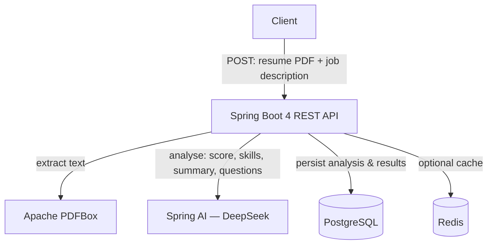

# Resume Analyzer 🤖📄

An **AI-powered resume analysis backend** built with **Spring Boot 4** and **Java 21**. Upload a resume (PDF) and a job description, and the service uses Large Language Models via **Spring AI** (**DeepSeek**) to score the match, surface missing skills, suggest improvements, and generate interview questions — backed by **PostgreSQL** for storage and optional **Redis** caching.

> A backend showcase of modern **AI-augmented Java development** with Spring AI.

---

## Overview

Resume Analyzer turns a resume + a target job description into structured, AI-generated insight. PDF text is extracted with Apache PDFBox, analysed by an LLM through Spring AI, and persisted in PostgreSQL. Redis optionally caches results to avoid repeat inference.

## Features

- 📄 **PDF resume parsing** — text extraction via **Apache PDFBox**.
- 🎯 **Resume ↔ job-description match scoring** — produces a **0–100 match score** (DB-enforced range).
- 🧩 **Missing-skills detection** — identifies skills present in the job description but absent from the resume.
- 📝 **AI summary & suggested improvements** — a concise fit summary plus actionable resume improvements.
- ❓ **Interview-question generation** — tailored questions based on the resume and role.
- 🔁 **Pluggable LLM backend** — DeepSeek via Spring AI; other providers can be swapped in by changing the model starter and config.
- ⚡ **Optional Redis caching** (off by default, `CACHE_ENABLED=true` to enable) to reduce latency and repeat LLM calls.
- 🧾 **Audit logging** of match-score changes; automatic `updated_at` triggers.
- 🐳 **Dockerised infrastructure** via Docker Compose.

## Architecture



## Analysis Result

A completed analysis returns a structure equivalent to:

```json
{
  "analysisId": 1,
  "matchScore": 85.0,
  "summary": "Strong backend fit; gaps in container orchestration.",
  "missingSkills": ["Kubernetes", "GraphQL"],
  "suggestedImprovements": [
    "Quantify impact in experience bullets",
    "Add a cloud/DevOps section"
  ],
  "interviewQuestions": [
    "Walk through a microservice you designed end to end.",
    "How would you tune a slow PostgreSQL query?"
  ]
}
```

> A response served from cache has no `analysisId` and nothing is written to the database.

## API Endpoints

| Method | Path | Description | Content-Type |
|--------|------|-------------|--------------|
| **POST** | `/api/v1/resume-analysis/analyze` | Analyze resume against job description | `multipart/form-data` |
| **GET** | `/api/v1/resume-analysis/{id}` | Retrieve a specific analysis by ID | `application/json` |
| **GET** | `/api/v1/resume-analysis/history` | Paginated analysis history | `application/json` |
| **GET** | `/api/v1/resume-analysis/recent` | Recent analyses (last N hours) | `application/json` |
| **GET** | `/api/v1/resume-analysis/health` | API health check | `text/plain` |

**POST `/analyze` Request:**
```bash
curl -X POST http://localhost:8080/api/v1/resume-analysis/analyze \
  -F "resumeFile=@resume.pdf" \
  -F "jobDescription=Senior Backend Engineer with Java, Spring Boot, PostgreSQL experience..."
```

**Example Response:**
```json
{
  "analysisId": 1,
  "matchScore": 85.0,
  "summary": "Strong backend fit; gaps in container orchestration.",
  "missingSkills": ["Kubernetes", "GraphQL"],
  "suggestedImprovements": ["Quantify impact in experience bullets", "Add a cloud/DevOps section"],
  "interviewQuestions": ["Walk through a microservice you designed...", "How would you tune a slow PostgreSQL query?"]
}
```

📖 **For detailed endpoint documentation, see [docs/API_DOCUMENTATION.md](docs/API_DOCUMENTATION.md).**

## Tech Stack

| Layer | Technology |
|------|------------|
| Language / Runtime | Java 21 |
| Framework | Spring Boot 4.0.5 (Spring MVC, Validation, Cache) |
| AI | Spring AI 2.0.0-M3 — DeepSeek model starter |
| Persistence | Spring Data JPA, PostgreSQL |
| Caching | Redis (optional) |
| PDF parsing | Apache PDFBox 3.0.2 |
| Build | Maven (wrapper included) |
| Infra | Docker, Docker Compose |
| Utilities | Lombok, Jackson (JSR-310) |

## Infrastructure (Docker Compose)

`docker compose up` starts the supporting services (the app itself runs via Maven):

| Service | Image | Port |
|--------|-------|------|
| PostgreSQL | `pgvector/pgvector:pg16` | 5432 |
| Redis | `redis:7-alpine` | 6379 |
| Redis Commander (UI, optional) | `rediscommander/redis-commander` | 8081 |
| pgAdmin (UI, optional) | `dpage/pgadmin4` | 5050 |

The PostgreSQL container auto-runs `init-db.sql` on first start (creates the schema, tables, indexes, and triggers).

## Prerequisites

- **JDK 21**
- **Docker & Docker Compose**
- A **DeepSeek API key**

## Getting Started

```bash
# 1. Clone
git clone https://github.com/srikanthchandra174/resume-analyzer.git
cd resume-analyzer

# 2. Start infrastructure (PostgreSQL, Redis, optional UIs)
docker compose up -d

# 3. Run the application (Maven wrapper)
./mvnw spring-boot:run        # Windows: mvnw.cmd spring-boot:run
```

The API starts on the configured port (default `8080`). PostgreSQL initialises automatically from `init-db.sql`.

## Run Locally Without Docker (Windows)

Only **JDK 21**, **PostgreSQL** and a **DeepSeek API key** are needed. Redis is optional: caching is off by default.

1. **Install PostgreSQL** (16 or newer).
2. **Create the database and user** (in `psql` as the `postgres` superuser):
   ```sql
   CREATE USER resumeuser WITH PASSWORD 'resumepassword';
   CREATE DATABASE resume_analyzer OWNER resumeuser;
   ```
3. **(Optional) Create the schema** with indexes, triggers and the audit table. Hibernate creates the core tables automatically if you skip this.
   ```powershell
   psql -U resumeuser -d resume_analyzer -f init-db.sql
   ```
4. **Set your DeepSeek key** for the current PowerShell session (or use `setx DEEPSEEK_API_KEY "sk-..."` to persist it, then open a new terminal):
   ```powershell
   $env:DEEPSEEK_API_KEY = "sk-..."
   ```
5. **Run the app:**
   ```powershell
   .\mvnw.cmd spring-boot:run
   ```
6. **Try it:**
   ```powershell
   curl.exe http://localhost:8080/api/v1/resume-analysis/health
   curl.exe -F "resumeFile=@C:\path\to\resume.pdf" -F "jobDescription=Senior Java developer with Spring Boot and PostgreSQL" http://localhost:8080/api/v1/resume-analysis/analyze
   ```

Optional environment variables: `DB_URL`, `DB_USERNAME`, `DB_PASSWORD`, `DEEPSEEK_MODEL` (default `deepseek-chat`), `SERVER_PORT`, `CACHE_ENABLED=true` with `REDIS_HOST`/`REDIS_PORT` to turn on Redis caching.

## Configuration

Set via environment variables (defaults in `application.yml`):

| Setting | Purpose |
|--------|---------|
| `DB_URL` / `DB_USERNAME` / `DB_PASSWORD` | PostgreSQL connection (local defaults are defined in `docker-compose.yml`) |
| `REDIS_HOST` / `REDIS_PORT` | Redis connection (only used when `CACHE_ENABLED=true`) |
| `CACHE_ENABLED` | Turns Redis caching on/off (default `false`) |
| `DEEPSEEK_API_KEY` + `DEEPSEEK_MODEL` | DeepSeek backend |
| `SERVER_PORT` | HTTP port (default `8080`) |

> ⚠️ **Never commit your DeepSeek API key.** Provide it via an environment variable or untracked local config.

## Database Schema

| Table | Purpose |
|------|---------|
| `resume_analysis` | Core record: file name, resume text, job description, `match_score` (0–100), summary, timestamps |
| `missing_skills` | Skills required by the JD but missing from the resume |
| `suggested_improvements` | AI-generated improvement suggestions |
| `interview_questions` | Generated interview questions |
| `analysis_audit_log` | Audit trail of match-score changes |

## Project Structure

```
resume-analyzer/
├── src/
│   ├── main/                 # Application source (controllers, services, config)
│   └── test/                 # Unit tests
├── docs/                     # Project documentation
├── init-db.sql               # Schema bootstrap (auto-run by Postgres container)
├── docker-compose.yml        # PostgreSQL, Redis, Redis Commander, pgAdmin
├── Dockerfile                # Application container image
├── pom.xml                   # Maven build & dependencies
└── mvnw / mvnw.cmd           # Maven wrapper
```

## Running Tests

Run the unit test suite with Maven (plain JUnit 5 + Mockito, no Spring context, no external services needed):

```bash
./mvnw test                    # Linux / macOS
mvnw.cmd test                  # Windows
```

## Engineering Highlights

- Built on **Spring Boot 4 / Java 21** with the current Spring ecosystem.
- **Provider-agnostic AI integration** via Spring AI — the model provider (currently DeepSeek) is isolated behind `ChatClient`.
- Designed a **normalised analysis schema** (match score, missing skills, improvements, interview questions) with referential integrity, full-text (GIN) indexes, and an audit log.
- Used **optional Redis caching** to cut latency and repeated inference cost.
- Reproducible local environment via **Docker Compose**, with DB bootstrapped from `init-db.sql`.

## License

Released under the [MIT License](LICENSE).
