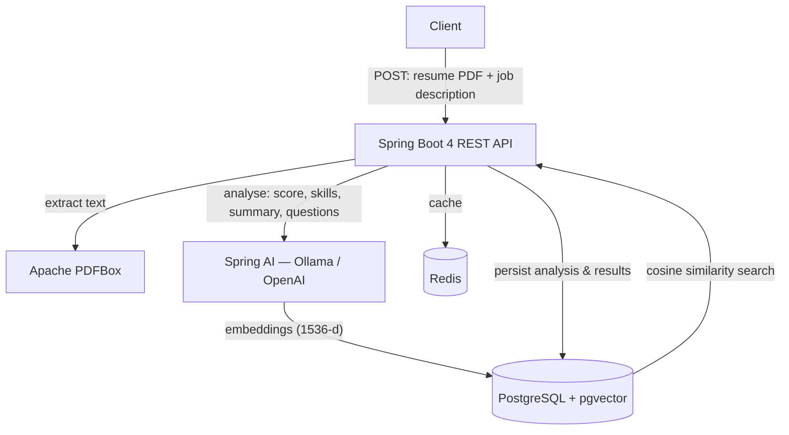

# Resume Analyzer 🤖📄

An **AI-powered resume analysis backend** built with **Spring Boot 4** and **Java 21**. Upload a resume (PDF) and a job description, and the service uses Large Language Models via **Spring AI** (pluggable **Ollama** for local inference or **OpenAI**) to score the match, surface missing skills, suggest improvements, and generate interview questions — backed by **PostgreSQL + pgvector** for semantic search and **Redis** for caching.

> A backend showcase of modern **AI-augmented Java development**: Spring AI, vector databases, and local LLM inference.

---

## Overview

Resume Analyzer turns a resume + a target job description into structured, AI-generated insight. PDF text is extracted with Apache PDFBox, analysed by an LLM through Spring AI, embedded into a pgvector store for similarity search, and persisted in PostgreSQL. Redis caches results to avoid repeat inference.

## Features

- 📄 **PDF resume parsing** — text extraction via **Apache PDFBox**.
- 🎯 **Resume ↔ job-description match scoring** — produces a **0–100 match score** (DB-enforced range).
- 🧩 **Missing-skills detection** — identifies skills present in the job description but absent from the resume.
- 📝 **AI summary & suggested improvements** — a concise fit summary plus actionable resume improvements.
- ❓ **Interview-question generation** — tailored questions based on the resume and role.
- 🔎 **Semantic search (RAG-ready)** — stores **1536-dimension embeddings** in **pgvector** with an IVFFlat cosine index for similarity search; GIN full-text indexes on resume and job-description text.
- 🔁 **Swappable LLM backend** — **Ollama** (local/private) or **OpenAI** via Spring AI, switchable through config.
- ⚡ **Redis caching** to reduce latency and repeat LLM calls.
- 🧾 **Audit logging** of match-score changes; automatic `updated_at` triggers.
- 🐳 **Dockerised infrastructure** via Docker Compose.

## Architecture



## Analysis Result

A completed analysis stores (and returns) a structure equivalent to:

```json
{
  "fileName": "resume.pdf",
  "matchScore": 85.0,
  "summary": "Strong backend fit; gaps in container orchestration.",
  "missingSkills": ["Kubernetes", "GraphQL"],
  "suggestedImprovements": [
    "Quantify impact in experience bullets",
    "Add a cloud/DevOps section"
  ],
  "interviewQuestions": [
    "Walk through a microservice you designed end to end.",
    "How would you tune a slow PostgreSQL query?"
  ]
}
```
> Exact endpoint paths and request/response DTOs live in `src/` — wire this shape to your controller's actual routes.

## Tech Stack

| Layer | Technology |
|------|------------|
| Language / Runtime | Java 21 |
| Framework | Spring Boot 4.0.5 (Spring MVC, Validation, Cache) |
| AI | Spring AI 2.0.0-M3 — Ollama & OpenAI model starters, vector-store advisors |
| Vector store | PostgreSQL + `pgvector` (1536-d embeddings, IVFFlat cosine index) |
| Persistence | Spring Data JPA, PostgreSQL |
| Caching | Redis, Redis OM Spring |
| PDF parsing | Apache PDFBox 3.0.2 |
| Build | Maven (wrapper included) |
| Infra | Docker, Docker Compose |
| Utilities | Lombok, Jackson (JSR-310) |

## Infrastructure (Docker Compose)

`docker compose up` starts the supporting services (the app itself runs via Maven):

| Service | Image | Port |
|--------|-------|------|
| PostgreSQL + pgvector | `pgvector/pgvector:pg16` | 5432 |
| Redis | `redis:7-alpine` | 6379 |
| Redis Commander (UI, optional) | `rediscommander/redis-commander` | 8081 |
| pgAdmin (UI, optional) | `dpage/pgadmin4` | 5050 |

The PostgreSQL container auto-runs `init-db.sql` on first start (enables the `vector` extension and creates the schema, tables, indexes, and triggers).

## Prerequisites

- **JDK 21**
- **Docker & Docker Compose**
- One LLM backend:
  - **Ollama** running locally with a pulled model, or
  - an **OpenAI API key**

## Getting Started

```bash
# 1. Clone
git clone https://github.com/srikanthchandra174/resume-analyzer.git
cd resume-analyzer

# 2. Start infrastructure (PostgreSQL + pgvector, Redis, optional UIs)
docker compose up -d

# 3. Run the application (Maven wrapper)
./mvnw spring-boot:run        # Windows: mvnw.cmd spring-boot:run
```

The API starts on the configured port (default `8080`). PostgreSQL initialises automatically from `init-db.sql`.

## Configuration

Set via environment variables / `application.properties`:

| Setting | Purpose |
|--------|---------|
| `SPRING_DATASOURCE_URL` / username / password | PostgreSQL connection (local defaults are defined in `docker-compose.yml`) |
| `SPRING_DATA_REDIS_HOST` / `PORT` | Redis connection |
| `SPRING_AI_OLLAMA_BASE_URL` + model | Local Ollama backend |
| `SPRING_AI_OPENAI_API_KEY` + model | OpenAI backend |

> ⚠️ **Never commit your OpenAI API key.** Provide it via an environment variable or untracked local config.

## Database Schema

| Table | Purpose |
|------|---------|
| `resume_analysis` | Core record: file name, resume text, job description, `match_score` (0–100), summary, embedding reference, timestamps |
| `missing_skills` | Skills required by the JD but missing from the resume |
| `suggested_improvements` | AI-generated improvement suggestions |
| `interview_questions` | Generated interview questions |
| `resume_embeddings` | 1536-d vector embeddings (IVFFlat cosine index) for semantic search |
| `analysis_audit_log` | Audit trail of match-score changes |

## Project Structure

```
resume-analyzer/
├── src/                  # Application source (controllers, services, config)
├── Sri_Docs/             # Project documentation / notes
├── init-db.sql           # pgvector + schema bootstrap (auto-run by Postgres container)
├── docker-compose.yml    # PostgreSQL (pgvector), Redis, Redis Commander, pgAdmin
├── Dockerfile            # Application container image
├── pom.xml               # Maven build & dependencies
└── mvnw / mvnw.cmd       # Maven wrapper
```

## Engineering Highlights

- Built on **Spring Boot 4 / Java 21** with the current Spring ecosystem.
- **Provider-agnostic AI integration** via Spring AI — switch between local (Ollama) and hosted (OpenAI) models through configuration.
- Designed a **normalised analysis schema** (match score, missing skills, improvements, interview questions) with referential integrity, full-text (GIN) indexes, and an audit log.
- Applied **vector embeddings + pgvector** (IVFFlat cosine) for semantic similarity — a practical **RAG** foundation on a relational database.
- Used **Redis caching** to cut latency and repeated inference cost.
- Reproducible local environment via **Docker Compose**, with DB bootstrapped from `init-db.sql`.

## Roadmap

- REST API documentation (OpenAPI / Swagger UI).
- Authentication and per-user analysis history.
- Batch analysis of multiple resumes against one job description.
- A lightweight front-end for uploads and results.

## License

Released under the [MIT License](LICENSE).
